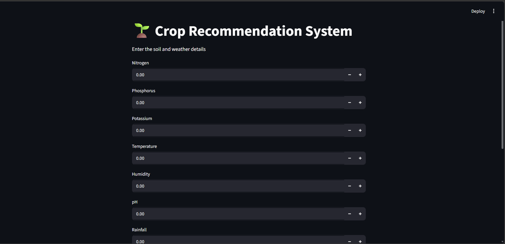

# Crop Recommendation System using Machine Learning

<p align="center">
  
</p>

<p align="center">


</p>

A comprehensive Machine Learning project that recommends the most suitable crop based on soil nutrients and environmental conditions. The system analyzes soil composition and climatic parameters to provide intelligent crop recommendations through an interactive Streamlit web application.

---

# Overview

Selecting the right crop is one of the most important decisions in agriculture. Soil fertility and environmental conditions directly affect crop yield and productivity.

This project leverages Machine Learning to recommend the most appropriate crop by analyzing soil nutrient values and weather conditions. The application provides real-time predictions through a user-friendly Streamlit interface.

The project demonstrates the complete Machine Learning lifecycle including data preprocessing, feature scaling, model training, evaluation, serialization, and deployment.

---

# Business Problem

Farmers often rely on traditional farming practices or personal experience when selecting crops. This may result in:

- Low agricultural productivity
- Poor soil utilization
- Financial losses
- Reduced crop quality
- Incorrect crop selection

This project helps solve these challenges by recommending crops using historical agricultural data and machine learning algorithms.

---

# Objectives

The primary objectives of this project are:

- Recommend the most suitable crop for cultivation
- Analyze soil nutrient composition
- Consider environmental conditions
- Improve agricultural decision-making
- Build an end-to-end Machine Learning solution
- Deploy the model through an interactive web application

---

# Dataset Information

The dataset contains soil and environmental parameters required for crop recommendation.

### Input Features

- Nitrogen (N)
- Phosphorus (P)
- Potassium (K)
- Temperature
- Humidity
- pH Value
- Rainfall

### Target Variable

- Recommended Crop

The model predicts one of the supported crop categories based on the input values.

---

# Technologies Used

## Programming Language

- Python

## Machine Learning

- Scikit-learn

## Data Analysis

- Pandas
- NumPy

## Data Visualization

- Matplotlib
- Seaborn

## Web Framework

- Streamlit

## Model Serialization

- Pickle

---

# Machine Learning Workflow

## Step 1 — Data Collection

- Imported agricultural dataset
- Loaded soil and weather data
- Prepared dataset for analysis

---

## Step 2 — Data Preprocessing

Performed:

- Data validation
- Feature selection
- Data cleaning
- Data formatting

---

## Step 3 — Exploratory Data Analysis (EDA)

Analyzed:

- Soil nutrient distribution
- Temperature distribution
- Rainfall analysis
- Humidity analysis
- Correlation between features
- Crop distribution

---

## Step 4 — Feature Scaling

Applied:

- StandardScaler

Feature scaling ensures consistent model performance across different input ranges.

---

## Step 5 — Model Development

Implemented a supervised Machine Learning classification model for crop recommendation.

The trained model predicts the most suitable crop using soil nutrients and weather conditions.

---

## Step 6 — Model Serialization

The trained model and preprocessing objects were saved using Pickle.

Files included:

- model.pkl
- scaler.pkl

---

## Step 7 — Streamlit Deployment

A professional web interface was developed using Streamlit.

Users simply enter:

- Nitrogen
- Phosphorus
- Potassium
- Temperature
- Humidity
- pH
- Rainfall

The application preprocesses the inputs, applies feature scaling, and predicts the recommended crop instantly.

---

# Features

- Interactive Streamlit UI
- Real-time crop recommendation
- Feature scaling using StandardScaler
- Machine Learning prediction engine
- Responsive interface
- Instant prediction results
- Simple and user-friendly workflow

---

# Project Structure

```
Crop-Recommendation-System/
│
├── app.py
├── crop_recommendation.ipynb
├── model.pkl
├── scaler.pkl
├── dataset.csv
├── requirements.txt
├── ui_crop.png
└── README.md
```

---

# Application Preview

<p align="center">
  
</p>

---

# Input Parameters

The application accepts the following inputs:

| Feature | Description |
|----------|-------------|
| Nitrogen | Soil Nitrogen Level |
| Phosphorus | Soil Phosphorus Level |
| Potassium | Soil Potassium Level |
| Temperature | Environmental Temperature |
| Humidity | Relative Humidity |
| pH | Soil pH Value |
| Rainfall | Rainfall Measurement |

---

# Output

The application predicts:

- Recommended Crop

Example:

```
Recommended Crop

Rice
```

---

# Business Applications

This solution can be used in:

- Smart Agriculture
- Precision Farming
- Agricultural Decision Support Systems
- Crop Planning
- Soil Health Analysis
- Government Agriculture Programs
- AgriTech Platforms

---

# Skills Demonstrated

This project demonstrates practical experience in:

- Machine Learning
- Classification Algorithms
- Data Preprocessing
- Feature Scaling
- Exploratory Data Analysis
- Streamlit Development
- Model Deployment
- Predictive Analytics
- Python Programming

---

# Future Improvements

- Weather API Integration
- Soil Sensor Integration
- Fertilizer Recommendation
- Disease Prediction
- Mobile Application
- Cloud Deployment
- Explainable AI (SHAP)

---

# How to Run

## Clone Repository

```bash
git clone https://github.com/yourusername/Crop-Recommendation-System.git
```

## Install Dependencies

```bash
pip install -r requirements.txt
```

## Run Application

```bash
streamlit run app.py
```

---

# License

This project is developed for educational and portfolio purposes.

---

# Author

**Parth Solanki**

Machine Learning Engineer | Data Scientist | Python Developer
