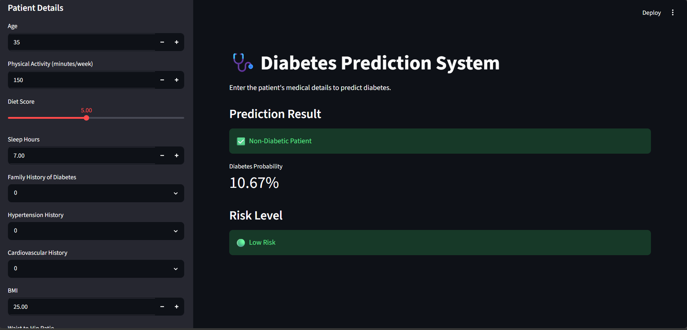

# Diabetes Prediction System using Machine Learning

<p align="center">
  
</p>

<p align="center">


</p>

A comprehensive Machine Learning project that predicts whether a patient is diabetic based on clinical, lifestyle, and medical parameters. The project combines advanced data preprocessing, predictive modeling, and an interactive Streamlit web application to assist in early diabetes risk assessment.

---

# Overview

Diabetes is one of the fastest-growing chronic diseases worldwide. Early diagnosis plays a crucial role in preventing severe health complications.

This project utilizes Machine Learning techniques to analyze patient health records and predict the likelihood of diabetes. Users can enter medical and lifestyle information through a professional Streamlit interface and instantly receive:

- Diabetes Prediction
- Probability Score
- Risk Level

The project demonstrates an end-to-end Machine Learning workflow from data preprocessing to deployment.

---

# Business Problem

Healthcare organizations need reliable systems to identify high-risk patients before severe complications occur.

Traditional screening methods can be:

- Time-consuming
- Resource-intensive
- Dependent on manual evaluation
- Difficult for large-scale screening

This project provides an intelligent decision-support system that assists healthcare professionals by predicting diabetes risk using patient health indicators.

---

# Objectives

The project aims to:

- Predict diabetes using patient medical information
- Analyze important health indicators
- Estimate diabetes probability
- Categorize patient risk level
- Build a deployable healthcare prediction system
- Demonstrate real-world Machine Learning implementation

---

# Dataset Information

The dataset contains medical, physiological, and lifestyle information collected from patients.

## Input Features

- Age
- Physical Activity (minutes/week)
- Diet Score
- Sleep Hours
- Family History of Diabetes
- Hypertension History
- Cardiovascular History
- BMI
- Waist-to-Hip Ratio
- Systolic Blood Pressure
- Diastolic Blood Pressure
- Total Cholesterol
- HDL Cholesterol
- LDL Cholesterol
- Triglycerides
- Fasting Glucose
- Postprandial Glucose
- Insulin Level
- HbA1c

## Target Variable

- Diabetes Status

---

# Technologies Used

## Programming Language

- Python

## Machine Learning

- Scikit-learn

## Data Analysis

- Pandas
- NumPy

## Data Visualization

- Matplotlib
- Seaborn

## Deployment

- Streamlit

## Model Serialization

- Pickle

---

# Machine Learning Workflow

## Step 1 — Data Collection

- Imported healthcare dataset
- Loaded patient medical records
- Verified data quality

---

## Step 2 — Data Cleaning

Performed:

- Missing value handling
- Duplicate removal
- Data validation
- Feature inspection

---

## Step 3 — Exploratory Data Analysis (EDA)

Analyzed:

- Diabetes distribution
- BMI distribution
- Blood glucose patterns
- Cholesterol analysis
- Blood pressure analysis
- Correlation between medical features

---

## Step 4 — Feature Engineering

Performed:

- Feature Selection
- Data Transformation
- Numerical Feature Processing

---

## Step 5 — Model Development

Machine Learning Algorithm Used:

- Random Forest Classifier

The model was trained to classify patients into diabetic and non-diabetic categories.

---

## Step 6 — Model Evaluation

Model performance was evaluated using:

- Accuracy Score
- Precision
- Recall
- F1 Score
- ROC-AUC Score
- Confusion Matrix

---

## Step 7 — Deployment

The trained model was deployed using Streamlit to provide real-time diabetes prediction.

---

# Streamlit Web Application

The application provides an interactive healthcare interface where users can enter patient details and receive instant predictions.

### User Inputs

- Age
- Physical Activity
- Diet Score
- Sleep Hours
- Family History
- Hypertension
- Cardiovascular History
- BMI
- Waist-to-Hip Ratio
- Blood Pressure
- Cholesterol Levels
- Glucose Levels
- Insulin Level
- HbA1c

### Prediction Output

The application displays:

- Diabetic / Non-Diabetic Prediction
- Diabetes Probability
- Risk Category (Low, Medium, High)

---

# Features

- Interactive Streamlit Dashboard
- Real-Time Diabetes Prediction
- Probability Estimation
- Risk Level Assessment
- Professional Healthcare Interface
- Machine Learning Powered Decision Support
- User-Friendly Design

---

# Project Structure

```
Diabetes-Prediction-System/
│
├── app.py
├── Diabetes_Prediction.ipynb
├── best_rf.pkl
├── requirements.txt
├── ui_Health.png
└── README.md
```

---

# Application Preview

<p align="center">
  
</p>

---

# Prediction Output

The application predicts:

- Diabetic Patient
- Non-Diabetic Patient

It also displays:

- Diabetes Probability (%)
- Risk Level
    - Low Risk
    - Medium Risk
    - High Risk

---

# Business Applications

This project can be used in:

- Hospitals
- Diagnostic Centers
- Healthcare Analytics
- Preventive Healthcare
- Telemedicine Platforms
- Clinical Decision Support Systems
- Medical Screening Applications

---

# Skills Demonstrated

This project demonstrates practical experience in:

- Machine Learning
- Classification Algorithms
- Random Forest
- Healthcare Analytics
- Data Cleaning
- Exploratory Data Analysis (EDA)
- Feature Engineering
- Model Deployment
- Streamlit Development
- Predictive Analytics
- Python Programming

---

# Future Improvements

- XGBoost Classifier
- LightGBM Integration
- SHAP Explainability
- Cloud Deployment (AWS/Azure)
- Electronic Health Record Integration
- Mobile Healthcare Application

---

# How to Run

## Clone Repository

```bash
git clone https://github.com/yourusername/Diabetes-Prediction-System.git
```

## Install Dependencies

```bash
pip install -r requirements.txt
```

## Run Application

```bash
streamlit run app.py
```

---

# License

This project is created for educational and portfolio purposes.

---

# Author

**Parth Solanki**

Machine Learning Engineer | Data Scientist | Python Developer
