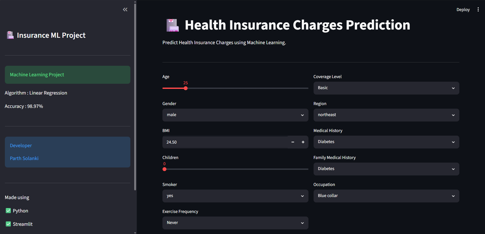

# Health Insurance Charges Prediction using Machine Learning

A comprehensive Machine Learning project that predicts individual health insurance charges based on demographic, lifestyle, and medical factors. The project combines data preprocessing, exploratory data analysis (EDA), feature engineering, regression modeling, and a professional Streamlit web application to deliver real-time insurance cost predictions.

---

# Overview

Health insurance providers use multiple customer attributes to estimate insurance premiums. Factors such as age, BMI, smoking habits, medical history, family medical history, occupation, and coverage level significantly influence insurance costs.

This project builds an end-to-end machine learning pipeline capable of accurately predicting health insurance charges using historical insurance data. A user-friendly Streamlit interface allows users to enter their personal information and instantly receive an estimated insurance premium.

---

# Business Problem

Insurance companies must accurately estimate customer premiums to minimize financial risk while providing competitive pricing.

Incorrect premium estimation can lead to:

- Financial losses
- High claim ratios
- Customer dissatisfaction
- Inefficient risk assessment
- Poor pricing strategies

This project provides a data-driven solution for estimating insurance charges using Machine Learning.

---

# Objectives

The primary objectives of this project are:

- Analyze factors affecting insurance charges
- Perform Exploratory Data Analysis (EDA)
- Build a regression model for insurance charge prediction
- Deploy the trained model using Streamlit
- Create an interactive prediction interface
- Generate accurate insurance cost estimates

---

# Dataset Information

The dataset contains customer demographic, lifestyle, and medical information.

### Features Used

- Age
- Gender
- BMI
- Number of Children
- Smoking Status
- Exercise Frequency
- Coverage Level
- Region
- Medical History
- Family Medical History
- Occupation

### Target Variable

- Insurance Charges

---

# Technologies Used

## Programming Language

- Python

## Machine Learning

- Scikit-learn

## Data Analysis

- Pandas
- NumPy

## Data Visualization

- Matplotlib
- Seaborn

## Web Framework

- Streamlit

## Model Serialization

- Pickle

---

# Machine Learning Workflow

## Step 1 – Data Collection

- Imported the insurance dataset
- Loaded the dataset into a Pandas DataFrame

---

## Step 2 – Data Cleaning

Performed:

- Missing value analysis
- Duplicate record removal
- Data validation
- Feature inspection

---

## Step 3 – Exploratory Data Analysis (EDA)

Analyzed:

- Insurance charge distribution
- Age vs Charges
- BMI vs Charges
- Smoking impact
- Medical history analysis
- Coverage level comparison
- Regional distribution
- Correlation analysis

---

## Step 4 – Feature Engineering

Applied:

### Label Encoding

Binary variables:

- Gender
- Smoking Status

### Ordinal Encoding

Coverage Levels

- Basic
- Standard
- Premium

Exercise Frequency

- Never
- Rarely
- Occasionally
- Frequently

### One-Hot Encoding

Categorical variables:

- Region
- Medical History
- Family Medical History
- Occupation

---

## Step 5 – Feature Scaling

Implemented:

- StandardScaler

Feature scaling was applied before training the regression model to improve prediction performance.

---

## Step 6 – Model Development

Machine Learning Algorithm Used:

- Linear Regression

The model was trained on processed and scaled data to predict insurance charges.

---

## Step 7 – Model Evaluation

Performance Metrics:

- R² Score
- Mean Absolute Error (MAE)
- Mean Squared Error (MSE)
- Root Mean Squared Error (RMSE)
- Cross Validation Score

### Model Performance

- Algorithm: Linear Regression
- Prediction Accuracy: **98.97%**

---

# Streamlit Web Application

The project includes a fully interactive Streamlit web application that allows users to predict insurance charges in real time.

### User Inputs

- Age
- Gender
- BMI
- Children
- Smoker
- Exercise Frequency
- Coverage Level
- Region
- Medical History
- Family Medical History
- Occupation

The application automatically:

- Encodes categorical variables
- Applies One-Hot Encoding
- Aligns input features with the trained model
- Performs feature scaling
- Generates insurance charge predictions

---

# Features

- Interactive Streamlit UI
- Real-time insurance charge prediction
- User-friendly input forms
- Automatic data preprocessing
- Feature encoding
- StandardScaler integration
- Linear Regression model
- Responsive dashboard
- Professional interface

---

# Project Structure

```
Health-Insurance-Charges-Prediction/
│
├── app.py
├── insurance_capstone.ipynb
├── model.pkl
├── scaler.pkl
├── columns.pkl
├── dataset.csv
├── requirements.txt
├── README.md
└── UI.png
```

---

# Project Workflow

```
Dataset
      │
      ▼
Data Cleaning
      │
      ▼
Exploratory Data Analysis
      │
      ▼
Feature Engineering
      │
      ▼
Encoding
      │
      ▼
Feature Scaling
      │
      ▼
Linear Regression Model
      │
      ▼
Model Evaluation
      │
      ▼
Pickle Serialization
      │
      ▼
Streamlit Deployment
```

---

# Model Inputs

The prediction model uses:

- Age
- Gender
- BMI
- Children
- Smoking Status
- Exercise Frequency
- Coverage Level
- Region
- Medical History
- Family Medical History
- Occupation

---

# Output

The application predicts:

- Estimated Health Insurance Charges

Example Output:

```
Estimated Insurance Charges

₹ 15,842.67
```

---

# Business Insights

The analysis reveals several important patterns:

- Smoking status has a significant impact on insurance charges.
- Higher BMI values generally increase insurance costs.
- Medical history strongly influences premium estimation.
- Premium coverage plans result in higher insurance charges.
- Age is positively correlated with insurance costs.
- Lifestyle factors such as exercise frequency affect predicted premiums.
- Family medical history contributes to overall insurance risk assessment.

---

# Skills Demonstrated

This project demonstrates practical experience in:

- Machine Learning
- Regression Analysis
- Data Cleaning
- Exploratory Data Analysis (EDA)
- Feature Engineering
- Feature Scaling
- One-Hot Encoding
- Label Encoding
- Model Serialization
- Streamlit Development
- Predictive Analytics
- Python Programming

---

# Dashboard Preview

## Streamlit Application



---

# How to Run

### Clone Repository

```bash
git clone https://github.com/yourusername/Health-Insurance-Charges-Prediction.git
```

### Install Dependencies

```bash
pip install -r requirements.txt
```

### Run Application

```bash
streamlit run app.py
```

---

# Real-World Applications

This project can be applied in:

- Insurance Companies
- Healthcare Analytics
- Premium Estimation Systems
- Risk Assessment
- Financial Planning
- HealthTech Platforms
- Predictive Pricing Systems

---

# Future Improvements

- Implement Random Forest Regressor
- XGBoost Regression
- CatBoost Regression
- Hyperparameter Tuning
- Explainable AI (SHAP)
- Model Deployment on AWS or Azure
- Docker Containerization
- User Authentication
- Insurance Recommendation System

---

# License

This project is developed for educational and portfolio purposes.

---

# Author

**Parth Solanki**

Machine Learning Engineer | Data Scientist | Python Developer

---
``` 

This README is structured like those commonly found in professional GitHub portfolios and covers the complete lifecycle of your project, from business context and preprocessing to deployment and future enhancements.
